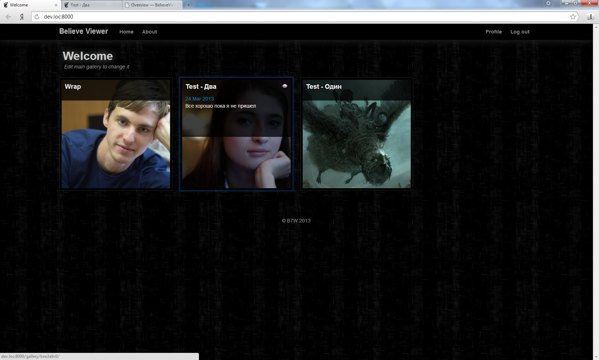
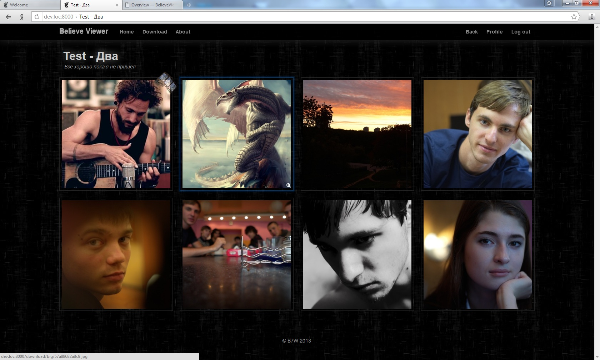
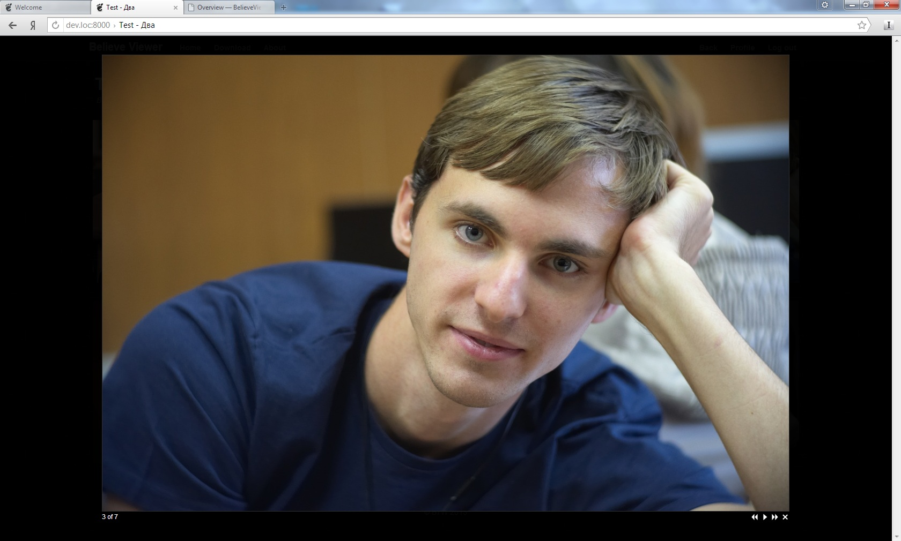

========
Overview
========

.. index:: Overview

About
=====

.. index:: About

| BelieveViewer is a simple photo gallery written in python with django.
  The main idea of this app is personal web photo and video sharing.
  There is no any comments, ratings, even registration and other social stuff.
  There is no complex management system.

| Why this app was developed? I have not found any nice gallery with content management.
  All existing software was or too simple, or looks terrible.

| BelieveViewer is open source project, released by MIT license.

Features
========

.. index:: Features

* | Gallery have nice dark template. It is scalable, and can be viewed in mobile devices.
    Images are cutting to square tile. For full image view there is js gallery that have navigation, slide show.

* | All images can be organized to galleries. Each gallery can store another galleries.
    Also you can specify description.

* | There is no registration for users, but galleries have some policies.
    Visible - visible for all users. Hidden - no mention in gallery tree, but can be accessed via url.
    Private - only for owner.

* | Images can't be upload to server via app, they have to stored there already.
    App automate resize and cache images. These parameters can be configured.

* | All real full size images in gallery can be download via zip archive.
    *Sub galleries not included.*

* | Video can be add from Vimio or YouTube.

* | Simple about page for information about owner.

* | Application is multi user, each user need separate domain name.

Functional features
===================

.. index:: Functional features

| Here some specific programming functions:

* | Viewer serve images with help of nginx X-Accel-Redirect.

* | All long operation run in separate processes.

Screen shots
============

.. index:: Screen shots

**Home page, list of galleries.**

**Gallery with images**

**JS gallery with full screen image**

